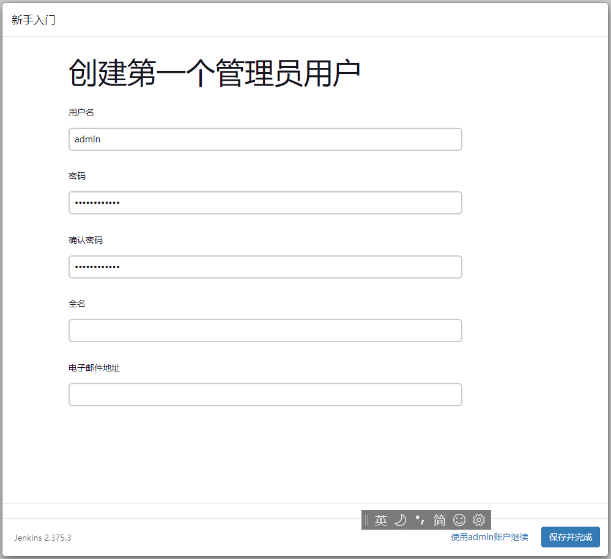

通过 Jenkins，我们可以实现代码的自动化部署，接下来，我们来看看如何安装和配置 Jenkins。

<!--more-->
## 安装 Java

目前最新版本的 Jenkins 依赖于 Java 11。我们需要安装 Java，CentOS 7 中执行 
```bash
sudo yum install java-11-openjdk -y
```

Ubuntu 执行：
```bash
sudo apt install openjdk-11-jdk
```
如果提示 `E: Unable to locate package openjdk-11-jdk`，则执行

```bash
sudo apt install software-properties-common
sudo add-apt-repository ppa:openjdk-r/ppa
sudo apt update
sudo apt install openjdk-11-jdk
```

安装 Java 完成后，执行 `java -version` 确认版本正确即可。

## 安装 Jenkins

CentOS 执行下面指令：
```bash
sudo rpm --import https://pkg.jenkins.io/redhat-stable/jenkins.io.key
sudo wget -O /etc/yum.repos.d/jenkins.repo https://pkg.jenkins.io/redhat-stable/jenkins.repo
sudo yum install jenkins
```

Ubuntu 执行：
```bash
wget -q -O - https://pkg.jenkins.io/debian/jenkins.io.key | sudo apt-key add -
sudo sh -c 'echo deb http://pkg.jenkins.io/debian-stable binary/ > /etc/apt/sources.list.d/jenkins.list'
sudo apt update
sudo apt install jenkins
```
如果 Ubuntu 在 `apt update` 执行提示：`server certificate verification failed. CAfile: /etc/ssl/certs/ca-certificates.crt CRLfile: none`。那么就执行 `sudo apt-get upgrade` 更新系统，再执行 `sudo apt update` 。

完成安装后，执行 `sudo systemctl status jenkins` 即可查看 Jenkins 启动状态，若 Failed，则执行 `sudo journalctl -xe` 查看 Log 排查错误原因。

## 配置 Nginx 

完成安装后，就可以配置 Jenkins 了，可以直接访问 http://服务器 IP 或域名:8080，或是先在 Nginx 配置映射一个 Location 或域名。

Nginx 配置映射域名，首先你要装好一个 Nginx，然后添加一个 Nginx 配置：

```conf
server {
  listen 80;

  # 若不使用 https 无需下面的内容
  listen 443 ssl http2;
  server_name jenkins.yourdomain.com;
  ssl_certificate /your/domain/certificate/fullchain.pem; 
  ssl_certificate_key /your/domain/certificate/key/privkey.pem;
  ssl_session_timeout 5m;
  # 若不使用 https 无需上面的内容

  access_log off;
  location / {
    proxy_pass http://127.0.0.1:8080;

    proxy_set_header Referer $http_referer;
    proxy_set_header Host $host;
    proxy_set_header X-Real-IP $remote_addr;
    proxy_set_header X-Forwarded-For $proxy_add_x_forwarded_for;
    proxy_set_header X-Forwarded-Proto $scheme;
    proxy_set_header X-Forwarded-Host $http_host;

    proxy_max_temp_file_size   0;
    client_max_body_size       10m;
    client_body_buffer_size    128k;

    proxy_connect_timeout      90;
    proxy_send_timeout         90;
    proxy_read_timeout         90;
    proxy_buffering            off;
    proxy_request_buffering    off;
    proxy_set_header Connection "";
  }

  # 若不使用 https 无需下面的内容
  if ($scheme = http) {
    return 301 https://$server_name$request_uri;
  }
  # 若不使用 https 无需上面的内容
}
```

若是要映射到域名某个路径下，则需要在初始化后配合 Jenkins 配置再做 Nginx 配置，见文后。

## 配置 Jenkins

完成 Nginx 配置后，再访问配置好的地址，将会出现如下画面：
  

在服务器执行 `sudo cat /var/lib/jenkins/secrets/initialAdminPassword` 查看到初始密码，填写到网页中，再点击下一步，则会提示安装插件，这里选择 安装推荐插件即可，如果你的服务器是在国内，那么建议在这一步前先将插件的更新下载地址更换为国内镜像，编辑 `/var/lib/jenkins/hudson.model.UpdateCenter.xml` 文件，将 `https://updates.jenkins.io/update-center.json` 修改为 ` https://mirrors.tuna.tsinghua.edu.cn/jenkins/updates/update-center.json`。然后重启服务。

  

完成插件安装后，就需要配置你的管理账号：

  

至此，你就已经完成了 Jenkins 的安装。

那么如果你要映射到域名某个路径下，此时就可以进入`系统管理 > 系统配置`（`/manage/configure`）。修改 `Jenkins URL`，为你要配置的地址。

然后，在域名的 Nginx 配置下添加下面的内容，再重启 Nginx 即可：

```conf
location /jenkins/ {
  proxy_pass http://127.0.0.1:8080;
  proxy_set_header Referer $http_referer;
  proxy_set_header Host $host;
  proxy_set_header X-Real-IP $remote_addr;
  proxy_set_header X-Forwarded-For $proxy_add_x_forwarded_for;
  proxy_set_header X-Forwarded-Proto $scheme;
  proxy_set_header X-Forwarded-Host $http_host;

  proxy_max_temp_file_size 0;
  client_max_body_size       10m;
  client_body_buffer_size    128k;

  proxy_connect_timeout      90;
  proxy_send_timeout         90;
  proxy_read_timeout         90;
  proxy_buffering            off;
  proxy_request_buffering    off;
  proxy_set_header Connection "";
}

location /jenkins {
  return 302 $scheme://$http_host/jenkins/;
}
```

